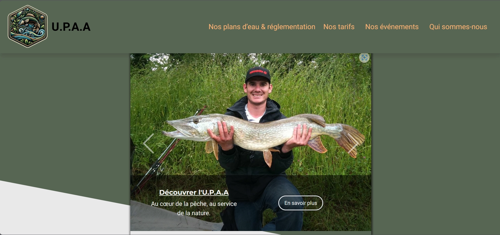
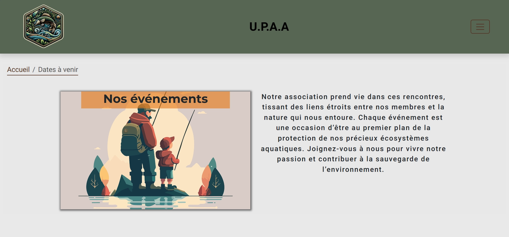

# Union of fishermen and management of aquatic environments(U.P.A.A.)

## Description
- This website is designed for the U.P.A.A. Fishing Association to showcase its activities, events, and environmental initiatives.
- It is created to validate the necessary skills in HTML5, CSS3, and BOOTSTRAP 5.2.3 within my Full Stack Web Developer training curriculum with the STUDI training organization.

## Table of Contents

- [Installation](#installation)
- [Features](#features)
- [Choice of Bootstrap Integration](#choice-of-bootstrap-integration)
- [Technologies Used](#technologies-used)
- [Usage](#usage)
- [Contribution](#contribution)
- [License](#license)
- [Contact](#contact)

## Installation
To use this site locally, follow the steps below:

```bash
git clone https://git@github.com:RuyssenRomain/U.P.A.A.git
cd U.P.A.A
```

## Features
- Responsive image carousel
- Interactive maps of the ponds
- Events section with a detailed calendar

 ## Choice of Bootstrap Integration

I have opted for the local integration of Bootstrap files rather than using a CDN for several key reasons:

- *Version Control*
- *Offline Availability*
- *Performance*
- *Security*
- *Customization*

This approach aligns the development of our site with best practices for increased stability and flexibility, while preparing us for smooth and controlled deployment.

## Usage
Navigate through the different sections of the site to discover our activities, fishing spots, rates, and the events we organize. The site is built with a mobile-first approach to ensure an optimal user experience on all devices.

## Technologies Used

- HTML5 for the base structure
- CSS3 for styling and animations
- Bootstrap 5.2.3 for responsive design and components


## Contribution
We warmly welcome contributions to this project! If you have improvements or corrections to propose, here's how to proceed:

### Steps to Contribute


1. **Fork the Project** : Start by forking the project on your GitHub account..

2. **Clone the Fork** : : Then, clone the forked project to your local machine to make changes. Use this command to clone it:
```bash
git clone https://git@github.com:RuyssenRomain/U.P.A.A.git
 ```

## License
This project is currently without a specific license and all rights are reserved. No use, modification, or distribution is authorized without explicit permission.

## Contact
For any questions or suggestions, please contact:
- RUYSSEN Romain 
- ruyssensud@gmail.com




